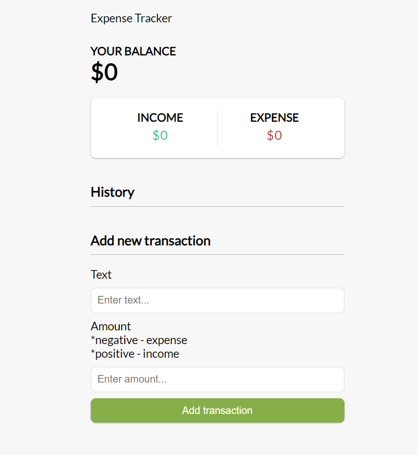

# expense-tracker

Expense tracker app with:
- Total balance
- Income balance
- Expenses balance
- Transactions history list (red border = expense, green border = income/deposite)
- Delete function to delete a specific transaction
- Form to add new transactions with text and amount field

## Stacks 

- Vue 3
- Vue Toastification Package (after adding a transaction and deleting a transaction)
- Data -> Save data to local storage

## Demo 

